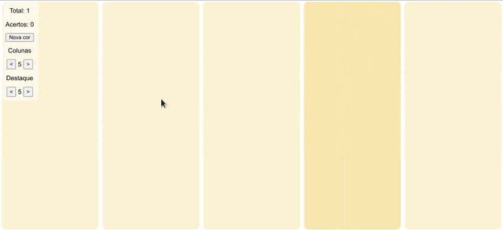

# nodejs-ts-reactjs-styledcomponents_color-diff-test



## Descrição / Description

Teste de percepção de cores programado em ReactJs, utilizando blocos com diferentes níveis de opacidade. O teste é personalizável. Esse projeto é inspirado em outros testes do mesmo tipo, encontrados na internet.

Color perception test programmed in ReactJs, using blocks with different levels of opacity. The test is customizable. This project is inspired by other tests of the same type found on the internet.

## Como rodar / How to run

> ⚠️ Necessita de um [navegador web](https://www.mozilla.org/pt-BR/firefox/download/thanks/) e do [NodeJS](https://nodejs.org/pt-br/). O projeto foi testado utilizando a versão `16.17.1`.

> ⚠️ Requires a [web browser](https://www.mozilla.org/pt-BR/firefox/download/thanks/) and [NodeJS](https://nodejs.org/en/). The project was tested using version `16.17.1`.

```bash
npm i # Install the packages / Instale os pacotes
```

```bash
npm start # Run the `start` script / Rode o script `start`
```

Após a compilação ocorrer, use o navegador para acessar o endereço `http://localhost:3000/`.

After compilation takes place, use the browser to access the address `http://localhost:3000/`.

## Rodar com o Docker / Run with Docker

> ⚠️ Necessita do [Docker](https://docs.docker.com/engine/install/) instalado no host para funcionar.

> ⚠️ Requires [Docker](https://docs.docker.com/engine/install/) installed on the host to work.

```bash
docker run -it --rm -v $(pwd):/app -p 3000:3000 node:16.17.1 npm --prefix=/app start
```
